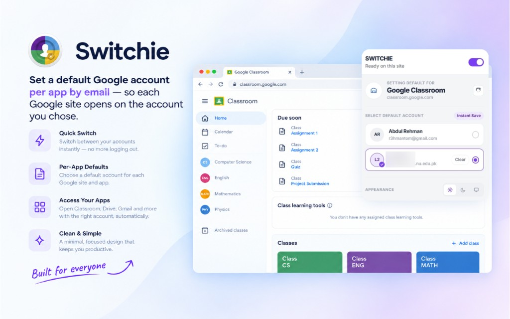
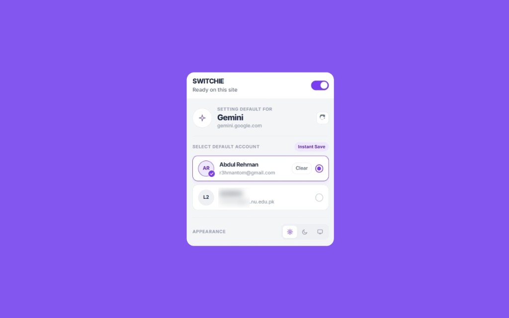
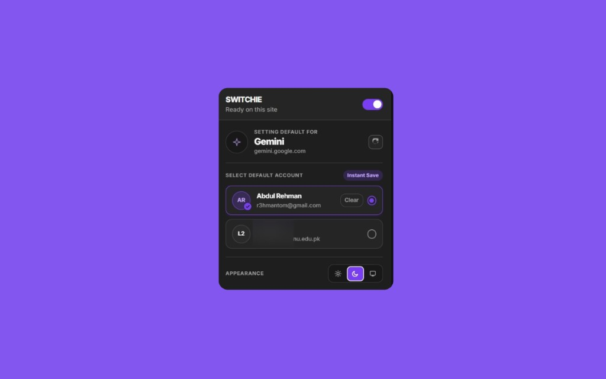

# Switchie

**Open Google Apps in the Right Account**

Set a default Google account per app by email — so Gmail, Drive, Classroom, YouTube, and the rest open on the account you chose.

Works on **Chrome** and **Firefox**. No account numbers in the UI. No server. Everything stays on your device.

## Install

  
  

- **Chrome:** [Chrome Web Store](https://chromewebstore.google.com/detail/switchie/mkpoidfobmpakibbfmeleddimkaahbaf)
- **Firefox:** [Firefox Add-ons](https://addons.mozilla.org/en-US/firefox/addon/open-google-apps-right-account/)
- **Homepage:** [r3hmantom.github.io/switchie](https://r3hmantom.github.io/switchie/)
- **Privacy policy:** [Privacy](https://r3hmantom.github.io/switchie/PRIVACY.html)

## What it does

Tired of opening the wrong Google account again?

Switchie lets you set a **default Google account for each Google app**, using a simple email picker. Choose once per site, then land on the right account next time you visit.

- Save a default Google account for the site you are on
- Pick accounts by **email** (not confusing account numbers)
- Optional auto-switch when you open a supported Google app
- Works across major Google apps for work, school, and personal use
- Light and dark theme

## How to use

1. Sign in to your Google accounts in the browser
2. Open a Google app (Gmail, Drive, Classroom, etc.)
3. Click the Switchie icon → **Refresh** if needed
4. Select an account and save it as the default for that site
5. Next visit — Switchie opens the right account automatically

## Demo

  

  
  &nbsp;
  

## Privacy

All preferences stay on your device. Switchie does not run a backend, sell data, or include analytics.

Full details: [Privacy policy](https://r3hmantom.github.io/switchie/PRIVACY.html)

## Notes

Switchie is an unofficial extension and is not affiliated with, endorsed by, or sponsored by Google LLC.

Built by [Abdul Rehman](https://github.com/r3hmantom).
